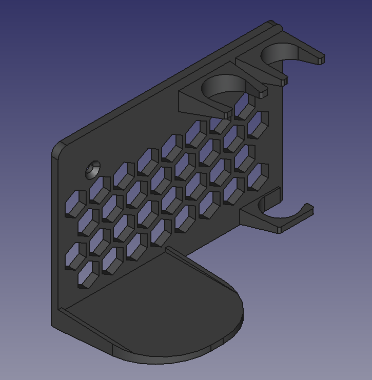
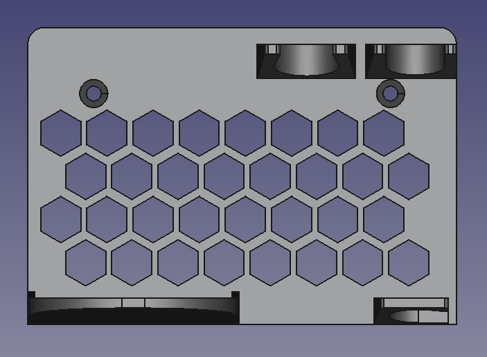

# Estação de solda de parede

Projeto de uma estação de solda de parede.

## Especificações

**Impressora:** Ender 3 KE
**Filamento:** ABS
**Fatiador:** Creality Print

## Objetivos

* Projetar uma base, fixada à parede que comporte os principais equipamentos para soldas eletrônicas;
    - Fluxo de solda;
    - Ferro de solda;
    - Estanho para solda;
* A peça projetada deve ser impressa;
* Sem processo de montagem
* Diminuir uso desnecessário de material;

## Conclusão

Projeto bem sucedido.

## Status

Finalizado

#Contato
gustavonnsanches@usp.br
+55 (11) 98884-0842 (São Paulo)