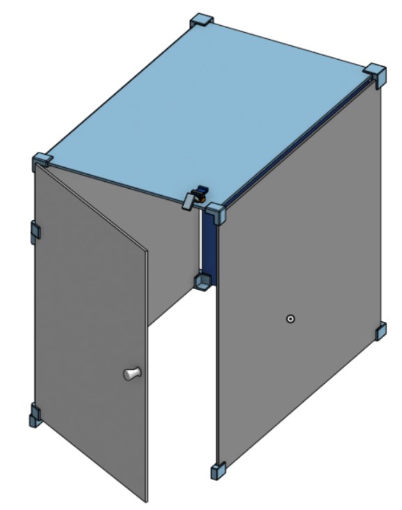
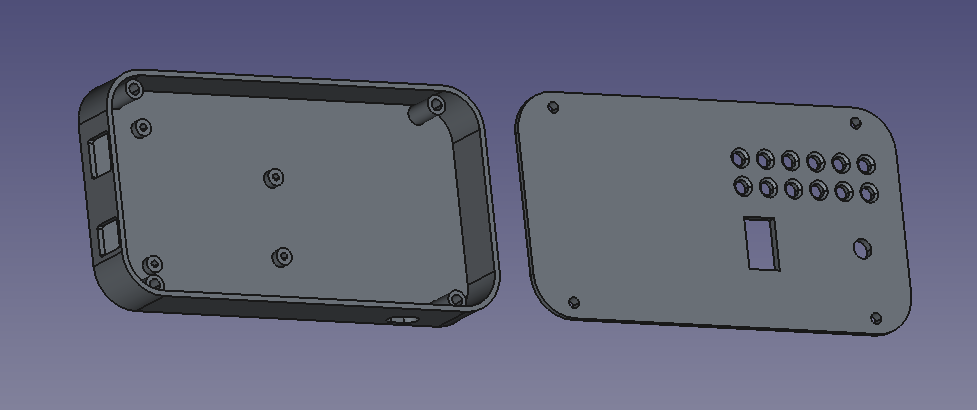
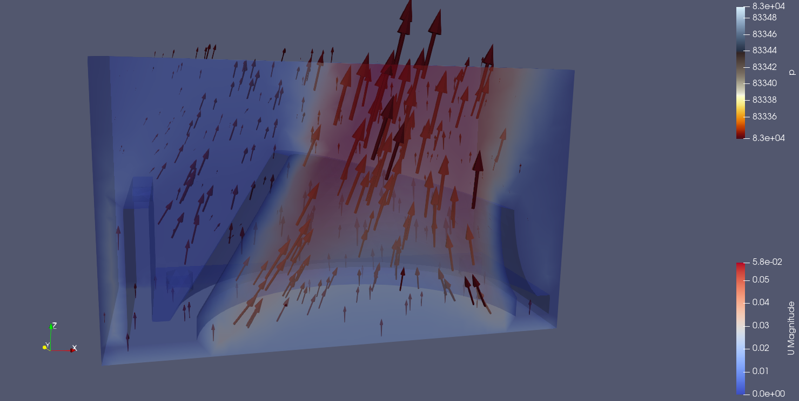

# Gabinete para impressora 3D

Projeto de um gabinete fechado, com porta frontal para controle de temperatura de impressão.

## Especificações

* Proteger a impressora/impressão de rajadas de vento;
* Adicionar algum isolamento térmico para aumentar a temperatura do volume de impressão;
* Sensoriar a temperatura para monitoramento;
* Adicionar mecanismo de aquecimento ativo manual (posteriormente automatizado).

## Ferramentas

* FreeCAD para modelagem 3D;
* CFD OpemFoam via FreeCAD para estudos de fluidoninâmica no bocal suporte da resistência de aquecimento.

## Materiais
    
* Telha de policarbonato alveolar (sobras);
* Conectores e acabamentos impressos em PLA ou ABS;
* Placa de espuma de poliestireno revestido;
* Arduíno uno R3;
* Fonte 12V 240W;
* Sensor de temperatura e umidade DHT11;
* Ventilador de computador;
* Resistência 100W;
* Painel impresso em PLA para acomodar o Arduíno;
* LED's para indicação da temperatura;
* Potenciômetro para escolha da temperatura.

## Conclusão

Projeto parcialmente bem sucedido.

As telhas de policarbonato e os conectores e acabentos impressos foram bem sucedidos em compor a estrutura do gabinete.

Posteriormente foram adicionadas cantoneiras impressas para melhor vedação e isolamento térmico.
Sem o gabinete fechado as temperaturas de impressão médias eram de 26°C. Com o uso do gabinete, as temperaturas médias atingiram 35°C após alguns minutos de aquecimento passivo. Por fim, após a adição das placas de espuma para isolamento térmico, as temperaturas puderam superar os 45°C.
A qualidade das impressões em ABS (material notavelmente sensível à variações de temperatura) aumentou consideravelmente, mas ainda não é suficiente para imprimir sem preocupações.

Foram feitos estudos de CFD (Computational Fluid Dynamics) para aprender a usar as ferramentas computacionais e melhorar o projeto do bocal que suporta a resistência de aquecimento.

A fonte 12V foi utilizada para alimentar o Arduíno, o ventilador e a resistência de aquecimento, porém se mostrou aquém dos parâmetros informados. A tensão diminui muito sob carga, atingindo 10V com demanda de aproximadamente 100W. Isso impede seu uso para alimentação do ventilador e da resistência de aquecimento simultaneamente. Isso tudo inutilizou o aquecimento ativo.

## Pontos de melhora

* Substituição da fonte por uma de melhor qualidade, que possa alimentar a resistência e o ventilador;
* Adição de iluminação interna;
* Adição de isolamento térmico na porta;
* Adição de isolamento térmico e refrigeração no compartimento da fonte de alimentação da impressora;
* Substituição dos LED's de indicação de temperatura por visores dedicados que utilizem menos saída do Arduíno;
* Automatização do controle do aquecedor;

## Status

Finalizado e pronto para melhorias.

#Contato
gustavonnsanches@usp.br
+55 (11) 98884-0842 (São Paulo)