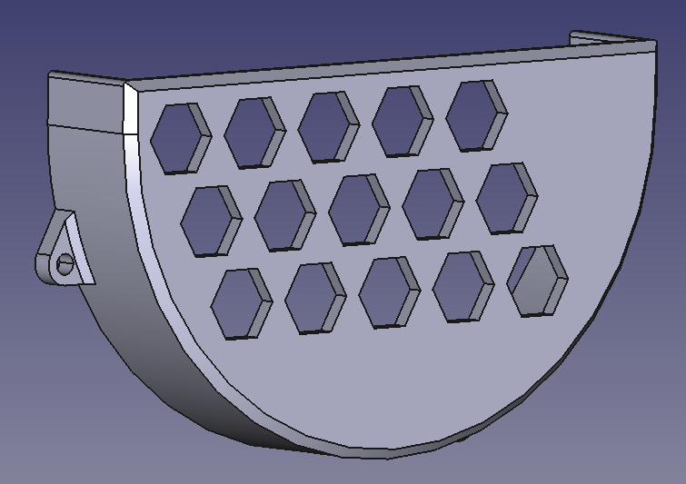

# Suporte para discos de esmerilhadeira

Projeto de um suporte para discos de esmerilhadeira.

## Especificações

**Impressora:** Ender 3 KE
**Filamento:** ABS
**Fatiador:** Creality Print

## Objetivos

* Projetar um suporte, para discos de esmerilhadeira que possa ser fixado verticalmente à estação de solda MIG;
* A peça projetada deve ser impressa;
* Sem processo de motagem;
* Diminuir uso desnecessário de material;

## Conclusão

Projeto bem sucedido.

## Status

Finalizado

#Contato
gustavonnsanches@usp.br
+55 (11) 98884-0842 (São Paulo)